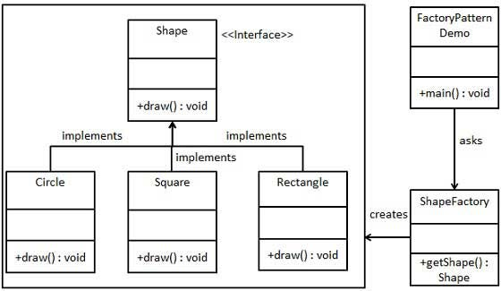

**"Reflect on Design Patterns"**
*Building Without a Blueprint*

If you’ve ever tried to build a piece of IKEA furniture without instructions, you probably know how frustrating it can be. You stare at a pile of wood, screws, and metal bits, hoping it will somehow turn into a bookshelf. That’s a lot like programming without design patterns. Design patterns are like those IKEA instructions—proven, reusable templates for solving common problems in software design. They don’t write the code for you, but they guide your thinking so that you don’t have to reinvent the wheel every time you build something new.

*Learning by Doing*

I didn’t really understand the value of design patterns until I worked on a group project for an event management app. As the code grew, it started to get messy. That’s when I used the Singleton pattern to make sure we only had one database connection throughout the app. Later on, I used the Observer pattern to update the UI whenever event data changed. These patterns helped bring structure to the project and made things easier to manage. I wasn’t following a strict rulebook—I was just solving problems with tools that worked.

*Patterns That Stick*

Now, design patterns are just part of how I think about writing code. I use them when they make sense because they save time and keep things clean. When I’m in interviews and someone asks about design patterns, I don’t just list names—I share real examples of when I used them and why. In the end, they’re not about sounding smart—they’re about making better software, and once you get the hang of them, they really stick.

